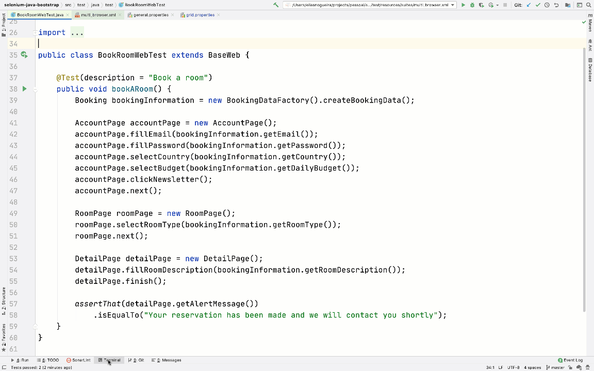

# Lean Test Automation Architecture using Java and Selenium WebDriver
[](https://github.com/eliasnogueira/selenium-java-lean-test-achitecture/actions)

**This project delivers to you a complete lean test architecture for your web tests using the best frameworks and practices.**

Local testing execution example


Parallel testing execution example with Zalenium


## Languages and Frameworks

This project using the following languages and frameworks:

* [Java 11](https://openjdk.java.net/projects/jdk/11/) as the programming language
* [TestNG](https://testng.org/doc/) as the UnitTest framework to support the test creation
* [Seleium WebDriver](https://www.selenium.dev/) as the web browser automation framework using the Java binding
* [AssertJ](https://joel-costigliola.github.io/assertj/) as the fluent assertion library
* [Allure Report](https://docs.qameta.io/allure/) as the testing report strategy
* [JavaFaker](https://github.com/DiUS/java-faker) as the faker data generation strategy
* [Log4J2](https://logging.apache.org/log4j/2.x/) as the logging manage strategy
* [WebDriverManager](https://github.com/bonigarcia/webdrivermanager) as the Selenium binaries management
* [Owner](http://owner.aeonbits.org/) to minimize the code to handle the properties file


## Test architecture

We know that any automation project starting with a good test architecture.
This project can be your initial test architecture for a faster start.
You will see the following items in this architecture:

* [Page Objects pattern](#page-objects-pattern)
* [Execution types](#execution-types)
* [BaseTest](#basetest)
* [TestListener](#testlistener)
* [Logging](#logging)
* [Configuration files](#configuration-files)
* [Parallel execution](#parallel-execution)
* [Test Data Factory](#test-data-factory)
* [Profiles executors on pom.xml](#profiles-executors-on-pomxml)
* [Pipeline as a code](#pipeline-as-a-code)

Do you have any other item to add on this test architecture? Please do a pull request or open an issue to discuss

### Page Objects pattern
I will not explain the Page Object pattern because you can find a lot of good explanations and examples on the internet. 
Instead, I will explain what exactly about page objects I'm using in this project.

#### AbstractPageObject
This class has a protected constructor to remove the necessity to init the elements using the Page Factory. 
Also, it sets the timeout from the `timeout` property value located on `general.properties` file.

All the Page Object classes should extend the `AbstractPageObject`.
It also tries to remove the `driver` object from the Page Object class as much as possible.

> **Important information**
>
> There's a `NavigationPage` on the `common` package inside the Page Objects.
> Notice that all the pages extend this one instead of the `AbstractPageObject`. I implemented this way:
> * because the previous and next buttons are fixed on the page (there's no refresh on the page)
> * to avoid create or pass the new reference to the `NavigationPage` when we need to hit previous or next buttons

As much as possible avoid this strategy to not get an `ElementNotFoundException` or `StaleElementReferenceException`.
Use this approach if you know that the page does not refresh.

### Execution types

There are two execution types: **local** and **grid**.
For both, there's a factory class [DriverFactory](https://github.com/eliasnogueira/selenium-java-bootstrap/blob/master/src/main/java/driver/DriverFactory.java) 
to resolve if the execution is local or remote based on the `target ` property value located on `general.properties` file.

The class [DriverManager](https://github.com/eliasnogueira/selenium-java-bootstrap/blob/master/src/main/java/driver/DriverManager.java) 
create a `ThreadLocal` for the WebDriver instance, to make sure there's no conflict when we run it in parallel.

#### Local execution
This execution type uses [WebDriverManager](https://github.com/bonigarcia/webdrivermanager) class to instantiate the web browsers.

The class [LocalDriverManager](https://github.com/eliasnogueira/selenium-java-bootstrap/blob/master/src/main/java/driver/local/LocalDriverManager.java) 
create a browser instance from the value placed on the `browser` property on the `local.properties` file.
It matches the browser name with an internal Enum type on WebDriverManager.

#### Remote execution
This execution type uses [RemoteDriverManager](https://github.com/eliasnogueira/selenium-java-bootstrap/blob/master/src/main/java/driver/remote/RemoteDriverManager.java) 
class to connect on the remote grid and create the browser instance.

The approach of the remote execution here was created to enable the parallel execution, but if you set the `target` 
property value to `grid` and run a test it will work because if there's no explicit browser in use, Google Chrome will be used. 
You can check this on the [BaseWeb](https://github.com/eliasnogueira/selenium-java-bootstrap/blob/master/src/main/java/test/BaseWeb.java) class.

You must pay attention to the two required information regarding the remote execution: the `grid.url` and `grid.port` 
property values on the `grid.properties` file. You must update these values before the start.

If you are using the `docker-compose.yml` file to start the Zalenium grid, the values on the `grid.property` file should work.

Please take a look at the [Parallel Execution](#parallel-execution) section.

### BaseTest
This testing pattern was implemented on the [BaseWeb](https://github.com/eliasnogueira/selenium-java-bootstrap/blob/master/src/main/java/test/BaseWeb.java) 
class to automatically run the pre (setup) and post (teardown) conditions.

The pre-condition uses `@BeforeMethod` from TestNG creates the browser instance based on the values passed either local or remote execution.
The post-condition uses `@AfterMethod` to close the browser instance.
Both have the `alwaysRun` parameter as `true` to force the run on a pipeline.

Pay attention that it was designed to open a browser instance to each `@Test` located on the test class.

This class also the `TestListener` that is a custom TestNG listener, and will be described in the next section.

### TestListener

The `TestListener` is a class that implements [ITestListener](https://testng.org/doc/documentation-main.html#logging-listeners).
The following method is in use to help logging errors and attach additional information on the test report:
* `onTestStart`: add the browser information into the test report
* `onTestFailure`: log the exceptions and add a screenshot on the test report
* `onTestSkipped`: add the skipped test on the log

### Logging
All the log is done by the Log4J using the `@Log4j2` annotation.

The `log4j2.properties` has two strategies: console and file.
A file with all the log information will be automatically created on the user folder with `test_automation.log` filename. 
If you want to change it, update the `appender.file.fileName` property value.

The `log.error` is used to log all the exceptions this architecture might throw. Use `log.info` or `log.debug` to log 
important information, like the users automatically generated by the factory [BookingDataFactory](https://github.com/eliasnogueira/selenium-java-bootstrap/blob/master/src/main/java/data/BookingDataFactory.java)

### Parallel execution
The parallel test execution is based on the [parallel tests](https://testng.org/doc/documentation-main.html#parallel-tests) 
feature on TestNG. This is in use on the `parallel.xml` test suite file by the `parallel="tests"` attribute and value, 
which means each `test` item inside the test suite will execute in parallel.
The browser in use for each `test` should be defined by a parameter, like:
```xml
<parameter name="browser" value="chrome"/>
```

You can define any parallel strategy.

It can be an excellent combination together with the grid strategy.

### Configuration files
This project uses a library called [Owner](http://owner.aeonbits.org/). You can find the class related to the property 
file reader in the following classes:
* [Configuration](https://github.com/eliasnogueira/selenium-java-bootstrap/blob/master/src/main/java/config/Configuration.java)
* [ConfigurationManager](https://github.com/eliasnogueira/selenium-java-bootstrap/blob/master/src/main/java/config/ConfigurationManager.java)

There are 3 properties (configuration) files located on `src/test/java/resources/`:
* `general.properties`: general configuration as the target execution, base url, timeout, and faker locale
* `grid.properties`: url and port for the Selenium grid usage (Zalenium)
* `local.properties`:  browser to use in the local execution

The properties were divided into three different ones to better separate the responsibilities and enable the changes easy 
without have a lot of properties inside a single file.

### Test Data Factory
Is the utilization of the Factory design pattern with the Fluent Builder to generate dynamic data.
The [BookingDataFactory](https://github.com/eliasnogueira/selenium-java-bootstrap/blob/master/src/main/java/data/BookingDataFactory.java) 
has only one factory `createBookingData` returning a `Booking` object with dinamyc data.

This dynamic data is generated by JavaFaker filling all the fields using the Build pattern.
The [Booking](https://github.com/eliasnogueira/selenium-java-bootstrap/blob/master/src/main/java/model/Booking.java) 
the class uses Lombok to reduce the boilerplate, easily providing getters, setters, constructors, and the build pattern.

Reading reference: https://reflectoring.io/objectmother-fluent-builder

### Profiles executors on pom.xml

There is a profile called `web-execution` created to execute the test suite _local.xml_ inside _src/test/resources/suites_ folder.
To execute this suite, via command line you can call the parameter `-P` and the profile id.

Eg: executing the multi_browser suite
``` bash
mvn test -Pmulti-browser
```

If you have more than one suite on _src/test/resources/suites_ folder you can parameterize the xml file name.
To do this you need:

* Create a property on pom.xml called _suite_

```xml
    <properties>
        <suite>local</suite>
    </properties>
```

* Change the profile id

```xml
<profile>
   <id>web-execution</id>
</profile>   
```

* Replace the xml file name to `${suite}` on the profile

```xml
<configuration>
   <suiteXmlFiles>
      <suiteXmlFile>src/test/resources/suites/${suite}.xml</suiteXmlFile>
   </suiteXmlFiles>
</configuration>
```

* Use `-Dsuite=suite_name` to call the suite

````bash
mvn test -Pweb_execution -Dsuite=parallel
````

### Pipeline as a code

The two files of pipeline as a code are inside `pipeline_as_code` folder.

* GitHub Actions to use it inside the GitHub located at `.github\workflows`
* Jenkins: `Jenkinsfile` to be used on a Jenkins pipeline located at `pipeline_as_code`
* GitLab CI: `.gitlab-ci.yml` to be used on a GitLab CI `pipeline_as_code`